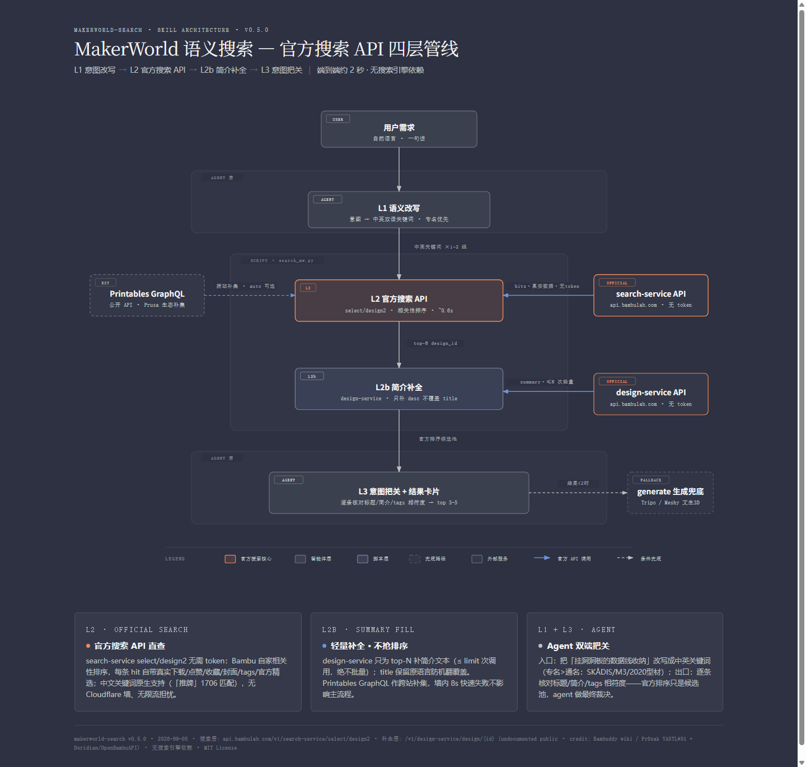

# makerworld-search

<p align="center">
  
</p>

**A natural-language semantic search skill for [MakerWorld](https://makerworld.com) (Bambu Lab's 3D-print model community) — for any AI agent.**

> Say *"find me a pegboard cable holder"* or *“搜一个怪物猎人冰箱贴”* — the agent rewrites your intent into bilingual keyword groups, queries **Bambu's official search API** (no token, no login), and hands you a shortlist ranked by Bambu's own relevance algorithm with **real official data** (downloads / likes / collections / staff-pick) on every result.

## Why

MakerWorld has no *documented* public API — but its production search backend is a plain, unauthenticated JSON endpoint. Community skills in this space are all printer-control; **model search is a 0-competitor niche**. Meanwhile, search engines only keyword-match — *“挂洞洞板的数据线收纳”* finds nothing. This skill closes both gaps on fully official data:

- **L1 semantic rewrite** (the agent itself): intent → 1–2 bilingual keyword groups (proper nouns beat generic terms: SKÅDIS, 2020 extrusion, M3)
- **L2 official search** (`search_mw.py`): `GET api.bambulab.com/v1/search-service/select/design2?keyword=…` — no token, ~0.6s, every hit already carries real download/like/collection counts, cover, tags, staff-pick flag, ranked by Bambu's own relevance algorithm (switchable to `--order downloads/hot/new/boosts`)
- **L2b summary fill** (built-in): top-N results get their description text via the design-service metadata endpoint — kept light (≤ limit calls), never batch
- **L3 intent gatekeeping** (the agent again): the agent checks title/summary/tags against your actual intent before showing top 3–5

Chinese keywords work natively — “推牌” returns 1,706 matches with the real Chinese fidget-slider models on top.

## Install

Works with any agent that reads the [Agent Skills](https://github.com/anthropics/skills) convention (Claude Code, OpenClaw, Cursor, Hermes, …). Drop the folder into your agent's skills directory, then:

```bash
pip install requests
```

No API keys. No login. No hardware required. No search-engine dependencies.

## Usage

```bash
# single keyword search (default: official relevance ranking)
python3 scripts/search_mw.py "phone stand" --limit 6
# sort by downloads / trending / newest / boost tokens
python3 scripts/search_mw.py "phone stand" --order downloads
# Chinese keywords work natively
python3 scripts/search_mw.py "推牌" --limit 6
# MakerWorld only (skip the Printables complement layer)
python3 scripts/search_mw.py "手机支架" --source intl
# metadata for one known URL
python3 scripts/search_mw.py --meta "https://makerworld.com/en/models/717070-phone-stand"
```

The agent side of the protocol (L1 rewrite rules, L3 gatekeeping checklist, card format) lives in [SKILL.md](SKILL.md).

## Provenance & compliance

- Both endpoints (`search-service` search, `design-service` metadata) are **undocumented but public** (plain GET, no auth) — the same `v1/*-service` microservice family. Reverse-engineering pattern first published by the **[Bambuddy](https://github.com/maziggy/bambuddy) wiki** (upstream credit: Pr0zak / YASTL#51); the Search Service endpoint table is cross-referenced in **[Doridian/OpenBambuAPI](https://github.com/Doridian/OpenBambuAPI)** `cloud-http.md`.
- Usage posture: one search call per keyword group + ≤ limit metadata calls per query. No batch scraping, no auth bypass, no file downloads.
- The optional Printables complement layer uses Printables' public GraphQL API and runs **in parallel** with the official search (since v0.6.0); on CN networks it is often unreachable (GFW) and fails fast (~8s) without delaying the main flow.
- MakerWorld model downloads require login by design — this skill gives you the link; you click it.
- Community context: users have long requested an official MakerWorld API ([forum #205669](https://forum.bambulab.com/t/makerworld-api/205669)); no documented API is planned. This skill wraps the *production* endpoints the official apps use — a community bridge until Bambu documents them.

## Verified runs

| Query | Result |
|---|---|
| “phone stand” | 4,652 matches; top hit 37.5k dl / 5k likes, matches web UI page 1 |
| “推牌” (fidget sliders) | 1,706 matches; real Chinese fidget-slider models on top (GAME BOY EDC 3.2k dl) |
| “洞洞板 数据线 收纳” (SKÅDIS cable mgmt) | 1,473 matches, SKÅDIS organizers on top |
| Monster Hunter keychain | staff-pick Palico keychain #1; no off-topic decoys (v1's DDG layer used to surface 5) |

v3 (official search API) is also ~10× faster end-to-end than the v2 DuckDuckGo-discovery pipeline it replaced (~2s vs ~24s).

## License

MIT — see [SKILL.md](SKILL.md) frontmatter. Endpoint credit: Bambuddy wiki / Pr0zak (YASTL#51) + Doridian/OpenBambuAPI.

---

# makerworld-search（中文说明）

**给任何 AI agent 用的 [MakerWorld](https://makerworld.com)（拓竹模型社区）自然语言搜索 skill。**

> 说「找一个挂洞洞板的数据线收纳」或 *"find me a Monster Hunter keychain"* — agent 把你的意图改写成中英双语关键词组，直接查**拓竹官方搜索 API**（无需 token、无需登录），交给你一份按官方相关性算法排序、每条都带**真实官方数据**（下载/点赞/收藏/官方精选）的候选清单。

## 为什么做这个

MakerWorld 没有*文档化*的公开 API——但它的生产搜索后端就是一个无需鉴权的 JSON 端点。这个领域的社区 skill 全是打印机控制类——**模型搜索是空白赛道**。而搜索引擎只会关键词匹配——搜「挂洞洞板的数据线收纳」什么都找不到。这个 skill 在纯官方数据上同时补上两个缺口：

- **L1 语义改写**（agent 自己做）：意图 → 1-2 组中英双语关键词（专名优于通名：SKÅDIS、2020型材、M3）
- **L2 官方搜索**（`search_mw.py`）：`GET api.bambulab.com/v1/search-service/select/design2?keyword=…` — 无需 token，~0.6s，每条结果自带真实下载数/点赞/收藏 + 封面 + tags + 官方精选标记，按官方相关性算法排序（可切 `--order downloads/hot/new/boosts`）
- **L2b 简介补全**（脚本内置）：top-N 结果经 design-service 元数据端点补描述文本——轻量调用（≤ limit 次），绝不批量抓取
- **L3 意图把关**（agent 自己做）：agent 按你的实际意图核对标题/简介/tags 后才输出 top 3-5

中文关键词原生支持——「推牌」直接返回 1706 个匹配，前排就是真实的中文推牌模型。

## 安装

适配任何遵循 [Agent Skills](https://github.com/anthropics/skills) 约定的 agent（Claude Code、OpenClaw、Cursor、Hermes 等）。把本目录放进你 agent 的 skills 目录，然后：

```bash
pip install requests
```

无需 API key。无需登录。无需打印机。无搜索引擎依赖。

## 用法

```bash
# 单关键词搜索（默认官方相关性排序）
python3 scripts/search_mw.py "phone stand" --limit 6
# 按下载量/热度/最新/Boost 排序
python3 scripts/search_mw.py "phone stand" --order downloads
# 中文关键词原生可用
python3 scripts/search_mw.py "推牌" --limit 6
# 只查 MakerWorld（跳过 Printables 补充层）
python3 scripts/search_mw.py "手机支架" --source intl
# 已知 URL 提取官方元数据
python3 scripts/search_mw.py --meta "https://makerworld.com/en/models/717070-phone-stand"
```

协议中 agent 侧的部分（L1 改写规则、L3 把关清单、卡片格式）在 [SKILL.md](SKILL.md)。

## 出处与合规

- 两个端点（search-service 搜索、design-service 元数据）均为**未文档化的公开接口**（纯 GET，无鉴权）——同一 `v1/*-service` 微服务族。逆向模式首发表于 **[Bambuddy](https://github.com/maziggy/bambuddy) wiki**（上游：Pr0zak / YASTL#51）；Search Service 端点表交叉引用自 **[Doridian/OpenBambuAPI](https://github.com/Doridian/OpenBambuAPI)** 的 `cloud-http.md`。
- 使用姿态：每关键词组一次搜索 + 每查询 ≤ limit 次元数据调用。不批量抓取、不绕验证、不代下载文件。
- 可选的 Printables 补充层用其公开 GraphQL API，且与官方搜索**并行**执行（v0.6.0 起）；国内网络常不可达（墙），8s 快速失败不拖慢主流程。
- MakerWorld 模型下载按官方设计需登录——skill 给你链接，你自己点。
- 社区背景：用户长期呼吁官方出 MakerWorld API（[forum #205669](https://forum.bambulab.com/t/makerworld-api/205669)）；官方无文档化计划。本 skill 封装的是官方 App 正在使用的*生产端点*——在拓竹文档化之前，这是社区桥接方案。

## 实测记录

| 查询 | 结果 |
|---|---|
| “phone stand” | 4,652 匹配；第一名 37.5k 下载 / 5k 赞，与网页版第一页一致 |
| 「推牌」 | 1,706 匹配；前排全中文推牌真模型（GAME BOY EDC 磁力推牌 3.2k 下载） |
| 「洞洞板 数据线 收纳」 | 1,473 匹配，SKÅDIS 收纳前排 |
| 怪物猎人钥匙扣 | 官方精选 Palico 钥匙排第一；零跑题引流（v1 DDG 时代会混入 5 个） |

v3（官方搜索 API）端到端也比 v2 的 DuckDuckGo 发现管线快约一个量级（~2s vs ~24s）。

## 许可

MIT — 见 [SKILL.md](SKILL.md) frontmatter。端点出处：Bambuddy wiki / Pr0zak（YASTL#51）+ Doridian/OpenBambuAPI。